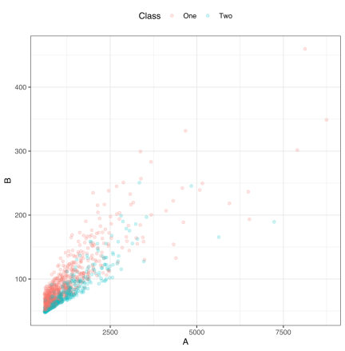

  


# Introduction

This article requires that you have the following packages installed: keras and tidymodels. You will also need the python keras library installed (see `?keras::install_keras()`).

We can create classification models with the tidymodels package [parsnip](https://tidymodels.github.io/parsnip/) to predict categorical quantities or class labels. Here, let's fit a single classification model using a neural network and evaluate using a validation set. While the [tune](https://tidymodels.github.io/tune/) package has functionality to also do this, the parsnip package is the center of attention in this article so that we can better understand its usage. 

# Fitting a neural network model


Let's fit a model to a small, two predictor classification data set. The data are in the workflows package and have been split into training, validation, and test data sets. In this analysis, the test set is left untouched; this article tries to emulate a good data usage methodology where the test set would only be evaluated once at the end after a variety of models have been considered. 


```r
data(bivariate)
nrow(bivariate_train)
#> [1] 1009
nrow(bivariate_val)
#> [1] 300
```

A plot of the data shows two right-skewed predictors: 


```r
ggplot(bivariate_train, aes(x = A, y = B, col = Class)) + 
  geom_point(alpha = .2)
```



Let's use a single hidden layer neural network to predict the outcome. To do this, we transform the predictor columns to be more symmetric (via the `step_BoxCox()` function) and on a common scale (using `step_normalize()`). We can use recipes to do so:


```r
biv_rec <- 
  recipe(Class ~ ., data = bivariate_train) %>%
  # There are some missing values to be imputed: 
  step_BoxCox(all_predictors())%>%
  step_normalize(all_predictors()) %>%
  # Estimate the means and standard deviations for the columns as well as
  # the two transformation parameters: 
  prep(training = bivariate_train, retain = TRUE)

# juice() will be used to get the processed training set back

val_normalized <- bake(biv_rec, new_data = bivariate_val, all_predictors())
# For when we arrive at a final model: 
test_normalized <- bake(biv_rec, new_data = bivariate_test, all_predictors())
```

We can use the keras package to fit a model with 5 hidden units and a 10% dropout rate, to regularize the model:


